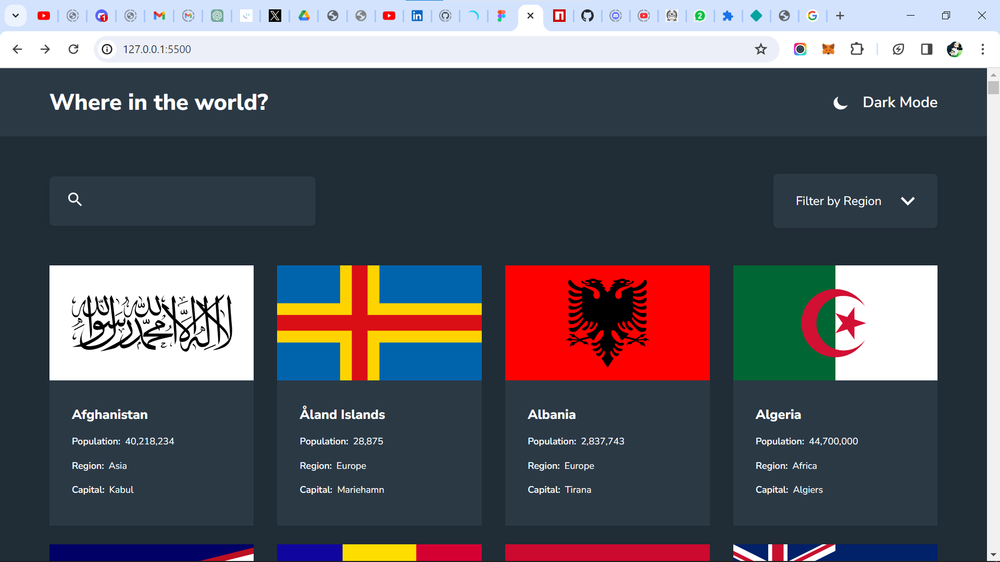
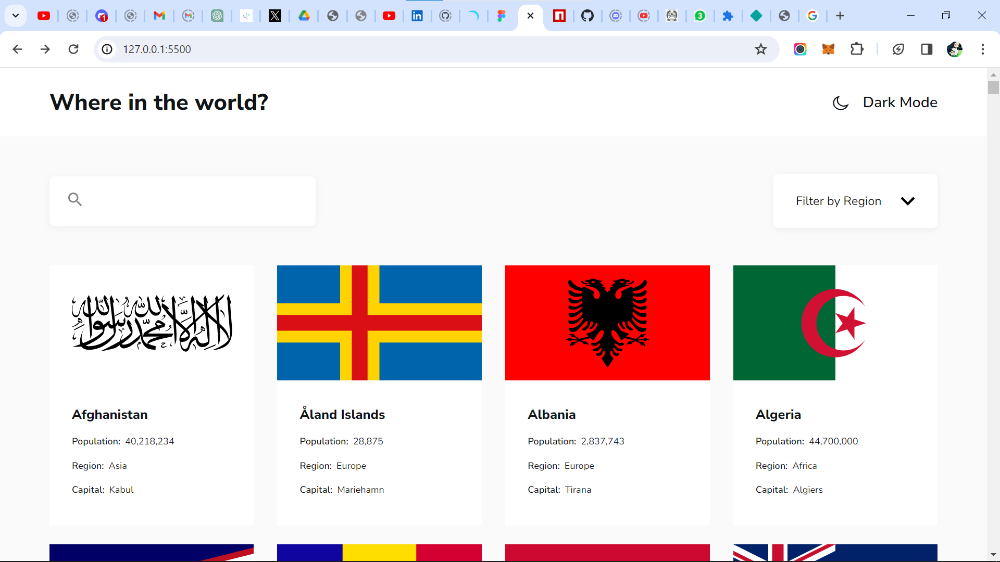
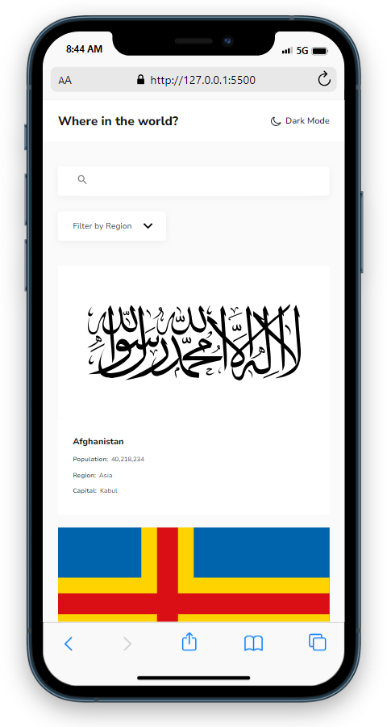

# Frontend Mentor - REST Countries API with color theme switcher solution

This is a solution to the [REST Countries API with color theme switcher challenge on Frontend Mentor](https://www.frontendmentor.io/challenges/rest-countries-api-with-color-theme-switcher-5cacc469fec04111f7b848ca). Frontend Mentor challenges help you improve your coding skills by building realistic projects. 

## Table of contents

- [Overview](#overview)
  - [The challenge](#the-challenge)
  - [Screenshot](#screenshot)
  - [Links](#links)
- [My process](#my-process)
  - [Built with](#built-with)
  - [What I learned](#what-i-learned)
  - [Continued development](#continued-development)
- [Author](#author)
- [Acknowledgments](#acknowledgments)

## Overview

### The challenge

Users should be able to:

- See all countries from the API on the homepage
- Search for a country using an `input` field
- Filter countries by region
- Click on a country to see more detailed information on a separate page
- Click through to the border countries on the detail page
- Toggle the color scheme between light and dark mode *(optional)*

### Screenshot






### Links

- Solution URL: [https://github.com/Lansa-18/Rest-Countries-API](https://github.com/Lansa-18/Rest-Countries-API)
- Live Site URL: [https://lansa-rest-countries.netlify.app](https://lansa-rest-countries.netlify.app)

## My process

### Built with

- Semantic HTML5 markup
- CSS custom properties
- Flexbox
- CSS Grid
- SCSS
- [Rest Countries API](https://restcountries.com/v3.1/)

### What I learned

Recently learnt how to work with APIs, using promises as well as the async, await method, put all those to practice when building this project.

This JS code, was very helpful in the sense that it handles the loading of the details page of each country, of course this is a helper function as you'll see me calling it in more than one place.

```js
const routingCountries = (countryData) => {
  // Select the newly added country elements
  const countriesDetails = document.querySelectorAll('.country');

  // Add the click event listeners to the country elements
  countriesDetails.forEach((country, index) => {
    country.dataset.index = index;
    country.addEventListener('click', e => {

      // Get the index from the data attribute
      const index = country.dataset.index;

      // Save the country data to sessionStorage
      localStorage.setItem(
        'countryData',
        JSON.stringify(countryData[index])
      );
      window.location.href = './details.html';
    });
  });
};
```

### Continued development

With the end of this project, i'm a step closer to completing my JS course. I'm so excited as i can't wait to dive into react.

## Author

- Frontend Mentor - [@GentleMizt](https://www.frontendmentor.io/profile/GentleMizt)
- Twitter - [@Lansa_18](https://twitter.com/Lansa_18)

## Acknowledgments

Special thanks to [ANONYMOUS](https://twitter.com/_Annonnymouss_) for his guidance and expertise. He really helped me spot out tons of bugs.

